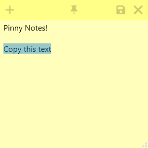

# Pinny Notes

Pinny Notes is a versatile sticky note application that allows you to “pin” notes, keeping them always on top of other windows. It also offers a variety of handy tools accessible via right-click menus.

## Features

- Pin / Always on Top: Easily pin notes to keep them above all other windows.
- Block Minimizing: Options to prevent notes from being minimized, e.g., when the Show Desktop button is pressed.
- Colors: Choose from multiple colors or cycle through them so each note is different.
- Dark Mode: Dark theme using the notes color for accent coloring.
- Transparency: Make notes transparent to help view information behind them.
- Start Position: Select where on the screen your notes will open.
- Copy/Paste Trim: Automatically trim text when copying from or pasting into a note.
- Middle Click Paste: Quickly paste text from the clipboard using the middle button.
- Copy on Click: Hold Ctrl to copy text when highlighted by mouse clicking.
- Auto Copy: Automatically copy text when highlighted.
- Full Line Select: Triple-click to select a line, quadruple-click to select the full line ignoring wrapping.
- Indent Text: Indent selected text by pressing the tab key.
- Auto Indent: Indent new lines to match the previous line.
- Ends with New Line: Ensure text always ends with a new line.
- Auto Scroll: Automatically scroll to keep the last line visible, making it easy when pasting text.
- Spell Checking: Integrated spell checker.
- Counts Menu: View line, word, and character counts of all or selected text.

## Tools

- Base64: Encode and decode to and from Base64.
- Case: Change text case to lower, upper, or proper.
- DateTime: Get the current date in a sortable format (e.g., 2024-07-11T12:00:00).
- Gibberish: Generate gibberish words, sentences, paragraphs, articles, and names.
- Hash: Generate SHA512/384/256, SHA1, and MD5 hashes.
- HTML Entities: Encode and decode HTML entities.
- Indent: Indent all lines by 2 or 4 spaces, or a tab.
- Join: Join multiple lines into one, separated by a comma, space, or tab.
- JSON: Prettify JSON.
- List: Enumerate, dash (markdown), sort ascending or descending, or remove list markers.
- Quote: Wrap text with double or single quotes.
- Remove: Remove various whitespace, slashes, or occurrences of selected text.
- Slash: Toggle or remove forward and back slashes.
- Split: Split lines into multiple lines by a comma, space, tab, or highlighted text.
- Trim: Trim whitespace from the start and/or end of each line or remove all blank lines.

## Installation - Windows Only

#### Installer

Download the latest release and run the installer.

#### Portable Version

Download the .zip file, extract it, and run Pinny Notes.exe.
