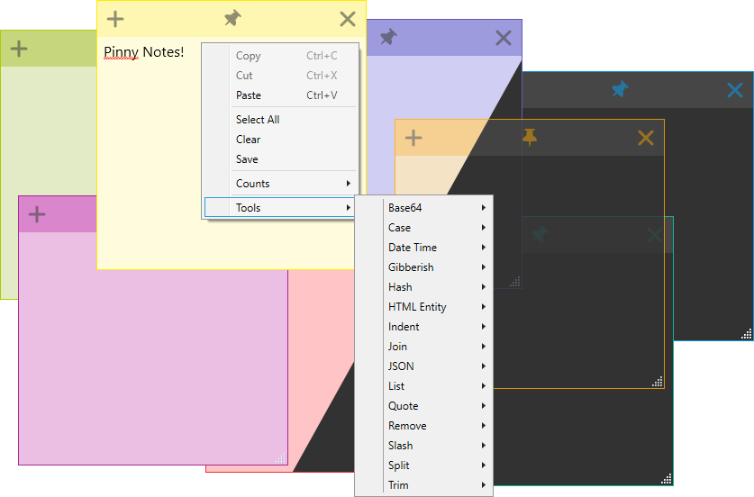

# Pinny Notes

## 📢 About

**Pinny Notes** is a versatile sticky note application that lets you "pin" notes, keeping them always on top of other windows. It also offers a variety of handy tools accessible via right-click menus.

## 🚀 Features

- **Pin / Always on Top:** Keep notes visible above all other windows.
- **Block Minimizing:** Prevent notes from being minimized, even with the Show Desktop button.
- **Colors:** Choose from multiple colors or have new notes cycle through them automatically.
- **Dark Mode:** Dark theme with color-matched accents.
- **Transparency:** Make notes semi-transparent so content behind them can still be seen.
- **Start Position:** Set where on the screen your notes will open.
- **Advanced Copy/Paste Actions**
  - **Copy/Paste Trim:** Automatically trim whitespace when copying or pasting.
  - **Middle Click Paste:** Quickly paste clipboard contents with a middle-click.
  - **Copy on Click:** Hold Ctrl and click to copy selected text.
  - **Auto Copy:** Automatically copy text when highlighted.
  - **No Selection Copy Behavior:** Choose whether to copy the current line, full note, or nothing when no text is selected.
- **Advanced Selection:**
  - **Triple-click:** Select current line.
  - **Quadruple-click:** Select the full line ignoring wrapping.
- **Indent Text:** Indent selected text by pressing the tab key.
- **Auto Indent:** Indent new lines to match the previous line.
- **Ends with New Line:** Ensures notes always end with a newline.
- **Auto Scroll:** Automatically scroll to keep the last line visible, making it easy when pasting text.
- **Spell Checking:** Integrated spell checker.
- **Counts Menu:** View line, word, and character counts for selected or full text.
- **Tray Icon:** Easily bring all notes to the front or launch new notes from the system tray.
- **Note Visibility:** Show or hide note windows from the Taskbar and Task Switcher (Alt+Tab and Win+Tab)

## 🛠️ Tools

- **Base64:** Encode/decode Base64 text.
- **Bracket:** Add/remove parentheses, square or curly brackets.
- **Case:** Convert to lower, upper, or proper case.
- **Color:** Convert RGB to and from HEX values.
- **DateTime:** Get the current date in a sortable format (e.g., 2024-07-11T12:00:00).
- **Gibberish:** Generate gibberish words, sentences, paragraphs, articles, and names.
- **Hash:** Generate MD5, SHA1, SHA256/384/512 hashes.
- **HTML Entities:** Encode/decode HTML entities.
- **Indent:** Indent all lines using 2/4 spaces or tabs.
- **Join:** Join multiple lines using commas, spaces, or tabs.
- **JSON:** Prettify JSON data.
- **List:** Add numbering or bullets (dash), sort lines, or remove list markers.
- **Quote:** Add or remove single, double, or backtick quotes.
- **Remove:** Strip whitespace, slashes, or repeated text.
- **Slash:** Toggle or remove forward/back slashes.
- **Split:** Split text by commas, tabs, spaces, or selected patterns.
- **Trim:** Remove line-leading/trailing whitespace or blank lines.

## 💾 Installation (Windows Only)

### 🔧 Installer

1. Go to the [Releases page](https://github.com/63BeetleSmurf/PinnyNotes/releases).
2. Download the latest `.msi` installer and run it.

### 👜 Portable Version

1. Download the latest `.zip` file from the [Releases page](https://github.com/63BeetleSmurf/PinnyNotes/releases).
2. Extract it and run `Pinny Notes.exe`.

> **⚠️ Linux Support Notice**
>
> A Linux version has been requested, but one is **not planned**. Pinny Notes is built using **WPF**, which is Windows-only. Even with a cross-platform framework, modern Linux desktops using **Wayland** do not allow applications to reliably set window positions or enforce “always on top” behavior, both of which are core features of Pinny Notes.

## ❤️ Support Development

Pinny Notes is developed in my spare time. If you find it helpful, please consider donating or sponsoring:

Every bit of support is appreciated 🙏
